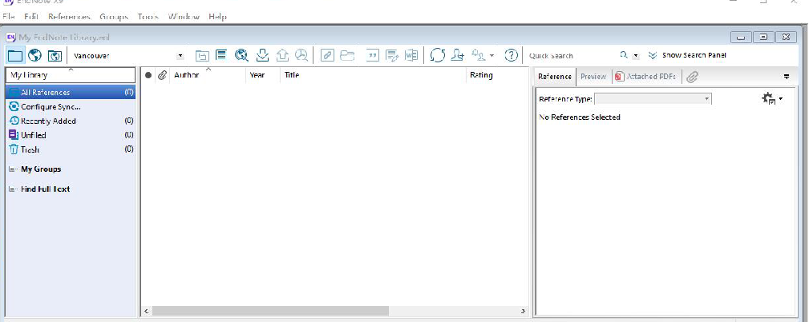
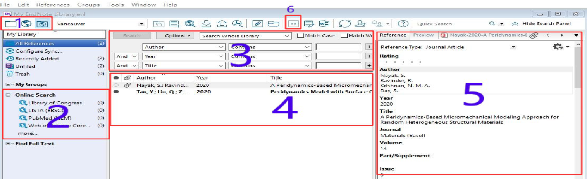

# EndNote文献管理软件简介

## 主要功能

###   1. 文献管理  

- 在本地建立个人数据库，随时查找收集到的中外文文献记录 ；            
- 通过检索结果，准确调阅所需 PDF全文、图片和表格；
- 将数据库与他人共享，对文献进行分组，分析和查重，自动下载全文。

### 2.  论文撰写    

- 随时调阅，检查相关文献，将其按照期刊要求的格式插入文后的参考文献；
- 迅速找到所需要的图片和表格，将其插入论文相应的位置；
- 在转投其他期刊时，可迅速完成论文及参考文献格式的转换。

## 安装 EndNoteX9  

1. 安装之前请关闭 Microsoft Office系列软件，卸载 EndNote的旧版本；
2. 点击`File` →  `new`  → `文件夹命名`，会得到两个文件，一个文件是`.Data`格式的， 主要用来存放文献全文的，另一个是 `.enl`格式的，新建后无任何文献记录，界面如下:

## 在线检索 

1. `Online Search`栏目下包括常用数据库，点击 `more`可以选择目标数据库(检索的数据库必须要有访问权限)，如果没有`Web of Science` 等数据库的访问权限，可以选择 `PubMed`数据库进行检索学习。  

        区域 1：离线，在线，混合模式(默认) 
        区域 2：常见几种数据库                               
        区域 3：检索方式，包括作者，年份以及标题等检索方式 
        区域 4：检索结果显示区
        区域 5：文献预览区域，包括文献信息，文献引文格式及摘要，文献PDF附件 
        区域 6：插入文献符号

2. 在区域4中用鼠标逐条点击文献记录，区域5中就会显示出该文献的引文格式以及文章摘要，从而可以进行高效文献阅读。

3. 在区域4中右键点击 `Rating`可以标记重要文献记录;选中要下载的文献条目，右键选择`Find Full Text`就可以下载全文，下载的文献会保存在 `My EndNote Library.Data`文件下的PDF文件夹中。

4. 文献条目前有标识，表示已经下载了全文，如需查阅全文内容，只需选中该文献条目，点击 `Attached PDFs`即可查看。如需全屏阅读，点击，在阅读过程中可以利用工具栏，进行高亮和下划线等，点击保存即可。

5. 根据研究内容，可以进行适当分组，右键点击 `My Groups`即可创建分组，分组包括 Great Group（创建组）；Great Smart Group（智能组）； Great Group Set（组集），然后将指定文件直接拖入分组中即可实现精准分组。

##  导入文献

###  1. 手动输入
​      点击主菜单栏中  `New Reference` ，手工输入参考文献，弹出新建参考文献界面， 输入相关信息即可。

###  2. 数据库导入

- #### Web of Science  Core Collection 数据库导入(SCI文献导入）

1. 在Web of Science页面中`选择数据库栏`中选择 `Web of Science核心合集`，输入关键词和检索条件，点击 `检索`，在检索结果页面中，选择所需要的排列方式，点击`导出至EndNote Desktop` ；
2. 在弹出框里输入要导入的文献记录以及输出内容，点击 `导出`，此时导出记录已经保存到 savedrecs.ciw 文件中；
3. 双击`savedrecs.ciw文件`，就可以将其导入到EndNote中，进而也可以拖到相应的组中。

- #### Google Scholar 检索导入

 1. 输入关键词，点击 `Cite`，再点击 `EndNote` ；

 2. 双击 `scholar.enw 文件`即可导入到 EndNote中，在弹出框里选择`scholar.enw 文件 `，`Import Option`中选择 `EndNote generated XML`(或`Refer/BiblX`)，其他默认。

- #### 百度学术导入

 1. 输入关键词，点击 `批量引用`；

 2. 点击页面右侧 标识，进入批量导出列表，点击 `导出至EndNote`；

 3. 双击 `baiduxueshu_papers.enw`文件即可导入到`EndNote` 中。

### 3.  PDF导入

- #### 单个PDF文件导入

     点击  `File ` →  ` Import ` →   `File ` (快捷键点击 )，在弹出的输入文件对话框中，选择要导入的 PDF文件，`Import Option`选择PDF， 其他默认。

- #### PDF文件批量导入

  点击  `File` →  `Import`  → `Folder`，在弹出的输入文件对话框中，`Import Folder`选择要导入PDF所在文件夹, 勾选`为导入的PDF创建组`，其他默认。

## EndNote在 word 中的使用

###  1.  word中插入参考文献 

  首先在word 菜单栏的 `EndNote`菜单下设置要插入的文献格式，将光标定位在待插入文献所在位置，然后在EndNote中将需要插入文档的参考文献选中，点击工具栏图标 ，就可将选中的文献条目按照已经设定的文献 格式插入到文档中。

### 2.  word中插入图表

  首先将带插入的图表以附件的形式附在参考文献，在`Caption`一栏输入图片标题，然后在word中将光标定位在待插入图片所在位置，在菜单下点击最左侧按钮 `Insert Citation`旁的下拉三角形，选择 `Insert Figure` ，在弹出的界面中搜索图片标题`选择要插入条目`，点击 `Insert` ，即完成插图。

## Latex中嵌入bib参考文献的简单步骤

1. 在你要编写的 `.tex`文件的同一目录下新建一个文本文档，命名为`.bib`；

2. 搜索论文的bib格式，将其粘贴到`.bib`文件中，点击保存bib文件；

3. 打开tex文件，在` \end{dobument}`前面输入`\bibliographystyle{文献风格}`和`\bibliography{bib文件名}`；

        Latex中的文献风格有8种：{plain}、{unsrt}、{abbrv}、{alpha}、{ieeetr}、{acm}、{siam}、{apalike}.

4. 在tex文件里，必须引用所有文献，即一定输入要引用的文献`\cite{...}`，这个花括号里输入的是刚才.bib文件里的`@article`中的逗号之前的内容，文中没有引用哪个文献在参考文献中就不会显示哪个文献；

5. 用latex编译tex文件。  

## 参考资料
1. EndNote X9.3.1汉化破解版：http://npupt.com/details.php?id=177365&hit=1

2. 手把手教你使用EndNote+X9: http://npupt.com/details.php?id=175231&hit=1