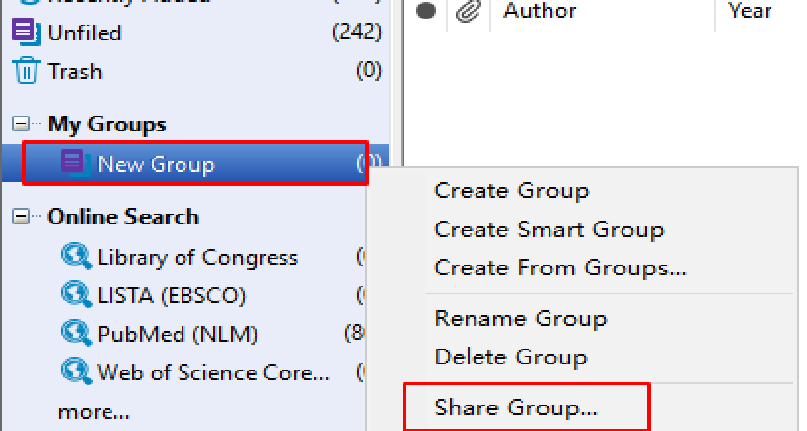

[TOC]

### EndNote文献管理软件简介

#### 1.主要功能

1.1 文献管理  :  

​       (1) 在本地建立个人数据库，随时查找收集到的中外文文献记录；               
​       (2) 通过检索结果，准确调阅所需 PDF全文、图片和表格;
​       (3) 将数据库与他人共享，对文献进行分组，分析和查重, 自动下载全文.

1.2 论文撰写:    

​    （1) 随时调阅，检查相关文献，将其按照期刊要求的格式插入文后的参考文献;
​    （2) 迅速找到所需要的图片和表格，将其插入论文相应的位置；
​    （3) 在转投其他期刊时，可迅速完成论文及参考文献格式的转换.

#### 2.主要操作

##### 2.1 安装 EndNoteX9 注意事项 

​      (1) 安装前请关闭 Microsoft Office系列软件;
​      (2) 安装之前先卸载 EndNote的旧版本.

##### 2. 2 文献管理

   首先安装 EndnoteX9 , 点击 File → new →文件夹命名，会得到两个文件，一个文件是 .Data 格式的, 主要用来存放文献全文的，另一个是 .enl 格式的，新建后无任何文献记录, 界面如下:

##### 2.3 在线检索 

   - “ Online Search ” 栏目下包括常用数据库，点击 “ more ”可以选择目标数据库(检索的数据库必须要有访问权限)，若无 “ Web of Science ” 等数据库的访问权限，可以选择 “PubMed ”数据库进行检索学习.  

​          1：离线，在线，混合模式(默认) 
​          2：常见几种数据库                               
​          3：检索方式，包括作者,年份以及标题等检索方式 
​          4：检索结果显示区
​          5：文献预览区域，包括文献信息，文献引文格式及摘要，文献PDF附件;  
​          6：插入文献符号

   - 在区域4中用鼠标逐条点击文献记录，区域5就会显示出该文献的引文格式以及文章摘要，从而可以进行高效文献阅读;

   - 在区域4中右键点击“Rating”可以标记重要文献记录;选中要下载的文献条目，右键选择 “ Find Full Text ”就可以下载全文，下载的文献会保存在 “ My EndNote Library.Data ”文件下的PDF文件夹中；

   - 文献条目前有 “ 回形针 ”标识，表示已经下载了全文，如需查阅全文内容，只需选中该文献条目，点击 “ Attached PDFs ”即可查看.如需全屏阅读，点击 ，在阅读过程中，可以利用工具栏，进行 “ 高亮，下划线 ” 等，点击保存即可.

##### 2.4 群组管理

​      根据研究内容，有必要进行适当分组，右键点击“ My Groups ”即可创建分组，分组包括三类：(1) Great Group; (2 )Great Smart Group; (3) Great Group Set, 分别是创建组，智能组以及组集. 
​      
   将指定文件拖入分组中即可实现精准分组，具体操作如下：
   选中待共享的分组，右键菜单选择 “ Share Group ”,此时会提示需要进行同步，同步之前需要注册 EndNote 账号. 随后在弹出如下对话框中，输入需要共享方的 Email ，设置共享用户分配阅读权限（“ 读写” 或 “ 只读”）; 此外可以留言，最后点击“ Invite ” 即可.  

##### 2.5 收集文献信息的方法

- #####   手动输入 ：
  点击主菜单栏中 “ New Reference  ” ,手工输入参考文献， 弹出新建参考文献界面, 输入相关信息即可.

- #####  联网检索 ： 
 " Online Search” 栏目下包括常用数据库，一般选择“ PubMed ”  数据库进行检索，输入关键词，点击 “ Search ”即可，当搜索面板左上角显示的是 “ Cancel ” 时，表示检索正在进行;当显示的是 “ Search” 时，表示检索已经完成.

- #####  数据库导入：
  ##### Web of Science  Core Collection 数据库导入(SCI文献导入):
  (1) 在Web of Science页面中 “ 选择数据库栏” 中选择 “ Web of Science核心合集 ”，输入关键词和检索条件，点击 “ 检索”，在检索结果页面中，选择所需要的排列方式，点击 “ 导出至EndNote Desktop” ，在弹出框里输入要导入的文献记录以及输出内容，点击 “ 导出 ”;

  (2) 此时导出记录已经保存到 savedrecs.ciw 文件中，双击“ savedrecs.ciw文件 ”，就可以将其导入EndNote中，拖到相应的组中.

  ##### Google Scholar 检索导入：
  (1) 输入关键词，点击 “ Cite ”,再点击 “ EndNote ” 即可;

  (2) 双击 scholar.enw 文件即可导入到 EndNote 中，在弹出框里选择scholar.enw 文件，“ Import Option ” 中选择 “ EndNote generated XML(或Refer/BiblX) ”, 其他默认.
  ##### 百度学术导入： 
   输入关键词，点击 “ 批量引用”,再点击页面右侧 “ 圆形”标识，进入批量导出列表，点击 “导出至” 后选择 “ EndNote ” 即可，双击 “baiduxueshu_papers.enw ”文件即可导入 “ EndNote ” 中.

- #####   PDF导入:
  ##### (1) 单个PDF文件导入
   点击 File →  Import →  File (也可以直接点击工具栏的导入按钮 )，在弹出的输入文件对话框中，选择要导入的 PDF文件，Import Option 选择 PDF, 其他默认即可. 
  ##### (2) PDF文件批量导入
   点击 File →  Import  →  Folder，在弹出的输入文件对话框中，“ Import  Folder ”选择要导入PDF所在文件夹, 勾选“ 为导入的PDF创建组”，其他默认即可.

#### 3.EndNote在 word 中的使用

   - word中插入参考文献 : 首先在word 菜单栏的 “ EndNote ” 菜单下设置要插入的文献格式，将光标定位在待插入文献所在位置,然后在EndNote中将需要插入文档的参考文献选中，点击工具栏图标 ，就可将选中的文献条目按照已经设定的文献格式插入文档中.

   - word中插入图表:  EndNote 还可以插入图表，首先将带插入的图表以附件的形式附在参考文献，在Caption一栏输入图片标题.然后在word中将光标定位在待插入图片所在位置，在菜单下点击最左侧按钮 “ Insert Citation ” 旁的下拉三角形，选择 “ Insert Figure ” ,在弹出的界面中搜索图片标题，选择要插入条目，点击 “ Insert ” ，即完成插图.

#### 4.Latex中嵌入bib参考文献的简单步骤

 (1) 在你要编写的tex文件的同一目录下新建一个文本文档，命名为*.bib；*

 (2) 搜索论文的bib格式，将其粘贴到*.bib文件中，点击保存bib文件；

 (3)  打开tex文件，在 \end{dobument}前面输入\bibliographystyle{文献风格}和  \bibliography{bib文件名}；
    Latex中的文献风格有8种：{plain}、{unsrt}、{abbrv}、{alpha}、{ieeetr}、{acm}、{siam}、{apalike}.

 (4) 在tex文件里，必须引用所有文献，即一定输入要引用的文献\cite{...},这个花括号里输入的是刚才.bib文件里的@article中的逗号以前的内容，文中没有引用哪个文献，在参考文献中就不会显示那个文献 ；

 (5) 用latex编译tex文件.  

