# FTP 相关

## 基本操作

### 获取相关软件

所使用的软件是 FileZilla（客户端和服务端）为免费软件，可以访问其官网 <https://filezilla-project.org/>，中文官网 <https://www.filezilla.cn/>。从中获取对应的服务端软件（如图所示给出的详细文件信息）和客户端软件。

**注意**：FileZilla 服务端仅仅支持 Windows 平台。

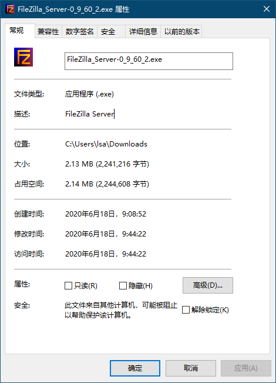

### 安装FileZilla server

**注意**：所有安装按默认操作即可，建议不要修改其中的参数；软件安装以及配置过程，中文版和英文版基本一样。

1. 引导界面

   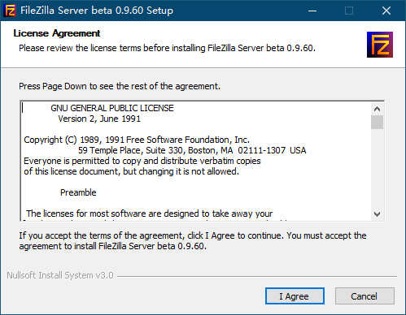

2. 选择安装内容界面

   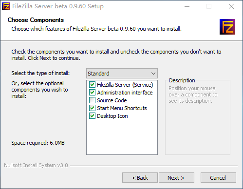

3. 修改安装路径界面

   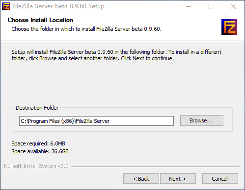

4. 服务启动配置界面

   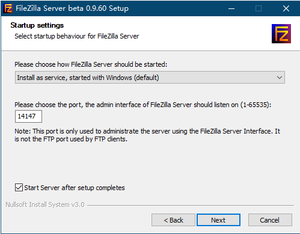

5. 安装完成，首次启动界面

   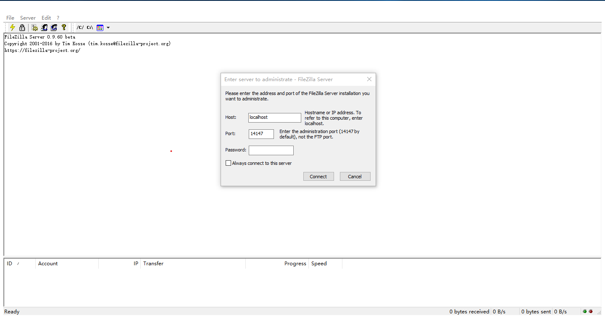

6. 设置密码（其他信息建议不要改动），勾选总是访问这个服务，点击连接（Connect），顺利启动 FTP 服务。（若有警告，参考被动模式设置，完成该项设置就无警告了）。

   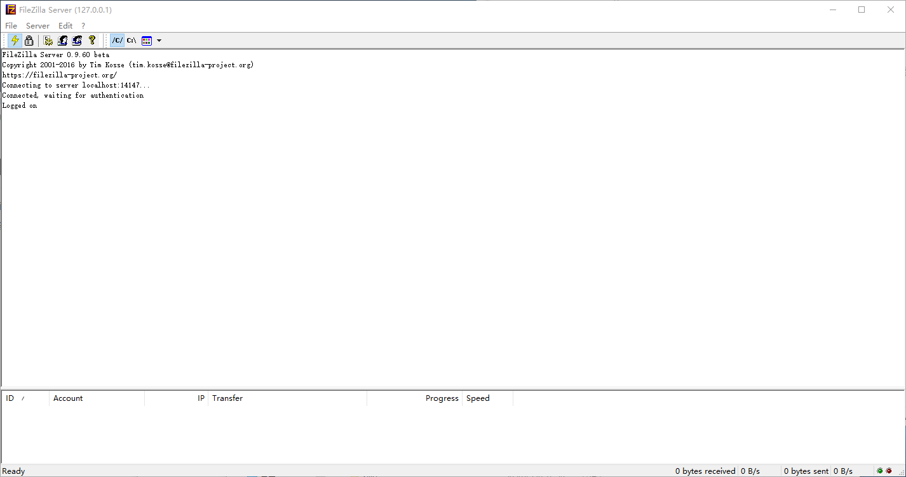

## 服务端配置

> 以下是在 Windows 10 平台上配置 FileZilla Server 的步骤

### 用户组设置

**注意**：通过用户组设置权限可以很好的管理用户，在新建用户时选择对应的用户组，就不需要对每个用户进行设置，减少工作量。

1. 点击主界面的 `Edit`（编辑）选择 `Groups`（用户组）按钮

   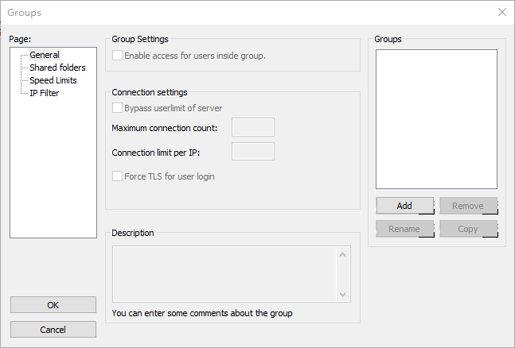

2. 选择 `General`（通用）按钮，选择右边的 `Add`（添加）按钮，输入用户组名称 `test`，其余设置默认

   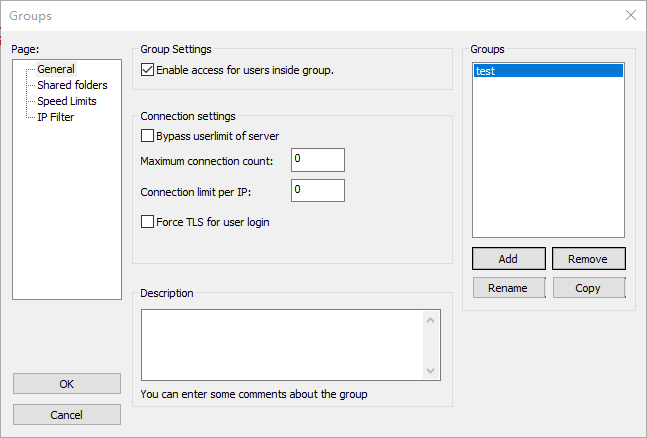

3. 选择 `Shared folders`（文件路径），点击左边的 `Add`，添加用户组对应的文件夹路径，默认第一次添加的路径为 FTP 用户访问时的主目录，根据需求选择中间的权限设置（权限含义参考其他相关内容小结）

   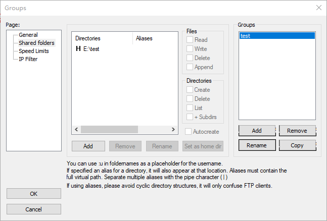

4. 点击 `OK` 完成用户组配置

### 用户添加

1. 点击主界面的设置按钮，选择 `Users`（用户）按钮（这一步与与用户组第一步操作类似）

2. 选择 `General`（通用）按钮，选择右边的 `Add`（添加）按钮，输入用户名称 `test`，选择设置好的用户组，添加密码，其余设置默认

   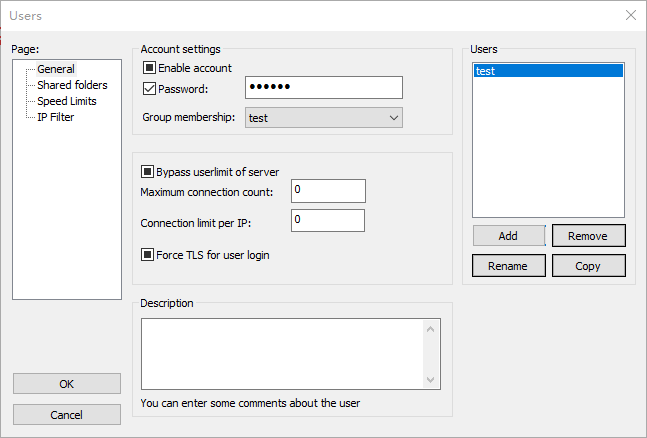

3. 选择 `Shared folders`（文件路径），可以点击左边的 `Add`，添加用户可以访问文件夹路径，根据需求选择中间的权限设置。若此处不添加任何路径，就以对应用户组的路径为默认路径。

   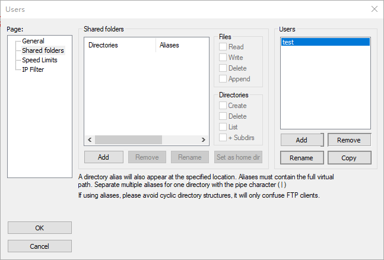

4. 点击 `OK` 完成用户配置

### 安全证书配置

1. 点击 `Edit`（编辑），选择设置，进入设置界面

   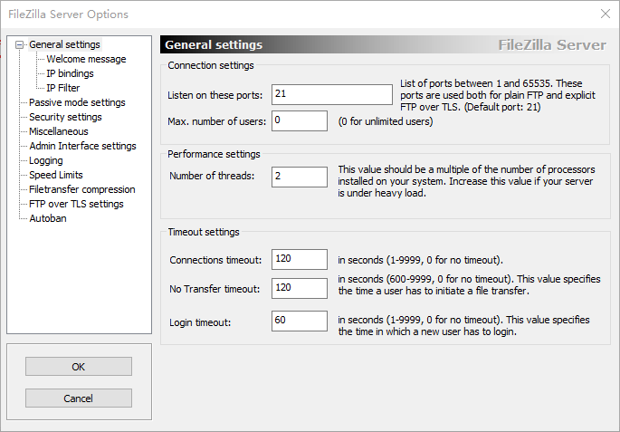

2. 选择 `FTP over TLS settings`

   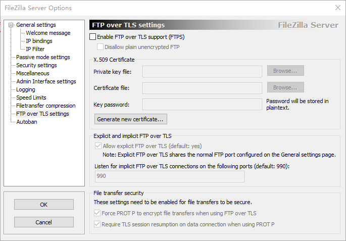

3. 选择界面中的 `Generate new certificate` 按钮，得到如下界面

   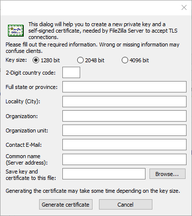

4. 可以根据情况填写相关信息（如果有相应的证书信息，`Country code` 必填），然后选择证书保存路径，没有就直接点击 `Generate certificate` 按钮，在点击确定，完成证书生成。

   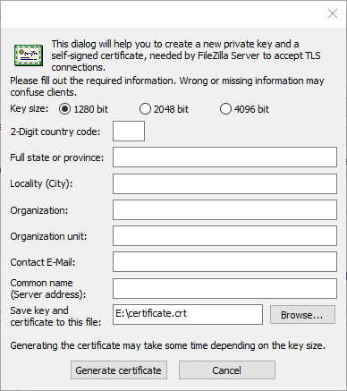

5. 再点击 `OK` 完成安全证书配置。

   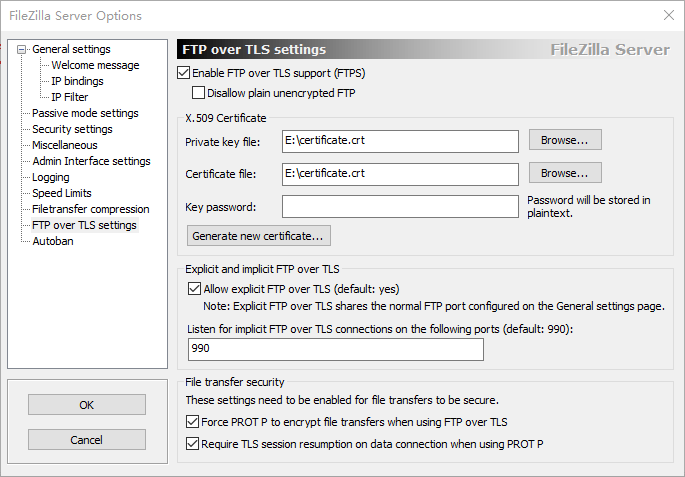

### 防火墙设置

1. 在 Windows 搜索工具中搜索防火墙设置

   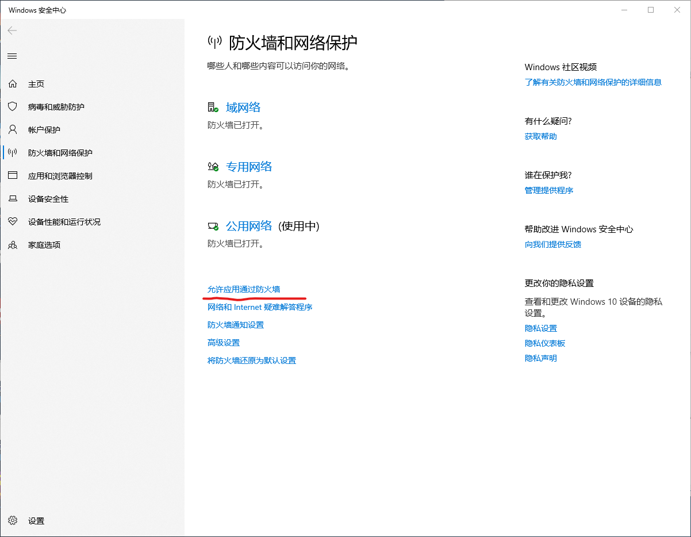

2. 点击允许应用通过防火墙，从列表中选择 FileZilla 相关的项目

   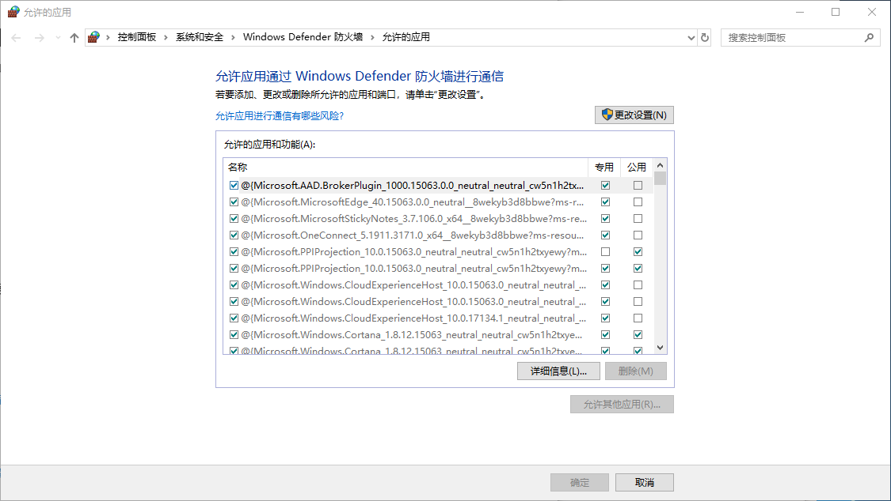

3. 如果没有找到，先选择`更改设置`，再选择`允许其他应用`，选择安装软件的路径，点击`添加`按钮

   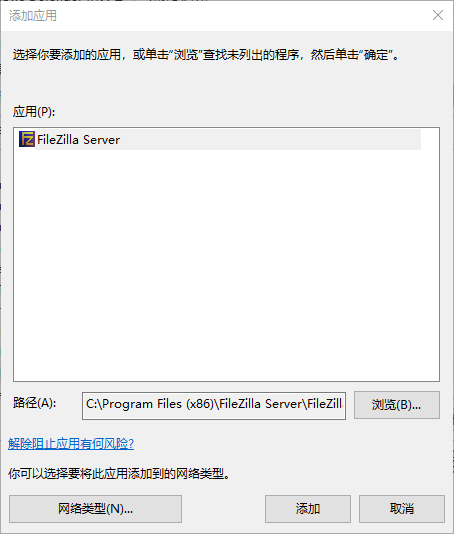

4. 添加完成后，将对应的专用和公用都勾上，点击`确定`，完成防火墙配置。

   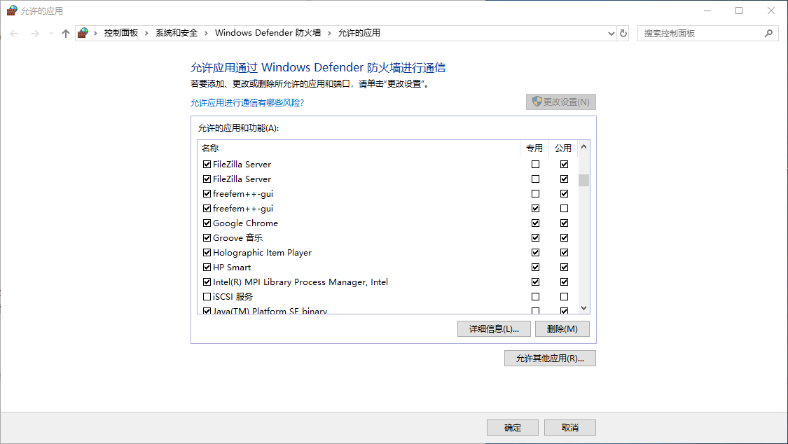

### 其他相关内容

#### 被动模式设置

1. 选择设置栏中的 `passive mode settings`

2. 勾选 `use the following IP`，在输入框中填写本机 IP 地址（查阅本机 IP 地址，可以在 `cmd` 中输入 `ipconfig` 可以查看），点击 `OK`，完成配置。

   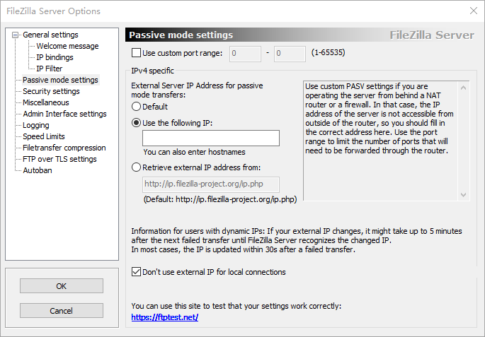

#### 关于用户组合用户中权限设置含义

1. 文件

| 关键字 | 表现效果   |
| ------ | :--------- |
| Read | 可下载文档 |
| Write  | 可上传文档 |
| Delete | 可删除文档 |
| Append |即把文件下载到本地副本并打开编辑，在关闭时再上传到服务器|

2. 文件夹

| 关键字   | 表现效果               |
| -------- | :--------------------- |
| Creat    | 可新增子文件夹         |
| Delete   | 可删除子文件夹         |
| List     | 可列出文件夹中的文档   |
| +Subdirs | 列出文件夹中的子文件夹 |

## 其他注意事项

1. 需要合理设置普通用户权限，管理员权限，防止文件误删。
2. 需要给用户强调上传文件是一定要弄清楚，一旦上传不可修改。
3. 需要给使用者除密码和用户名外，还需要提供IP地址。
4. 在不需要使用时，将客户端关闭，减少宽带占用。
5. 需要强调错开高峰上传文件，分批传文件。

## 扩展

- [ ] 以上给出的 FTP 服务是搭建在 Windows 平台上的，将来若需要迁移到 Linux 平台上，可以考虑使用 `vsftpd`。
- [ ] 在 FTP 服务上有经验分享内容，可以使用 Hugo 在 Windows 上搭建博客系统，方便查阅信息。

## 参考资料

1. https://m.jb51.net/article/122172.htm