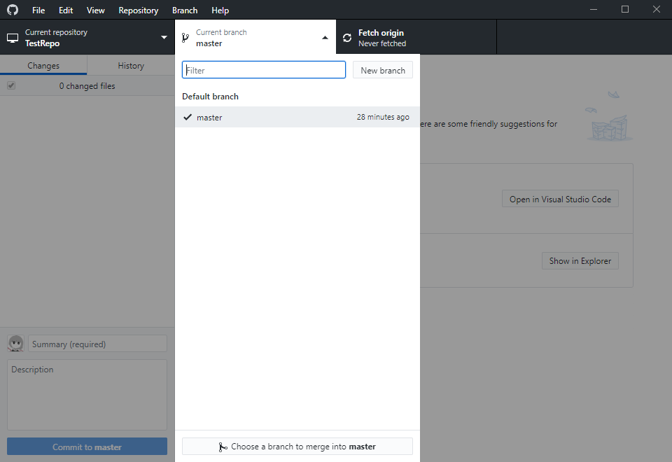
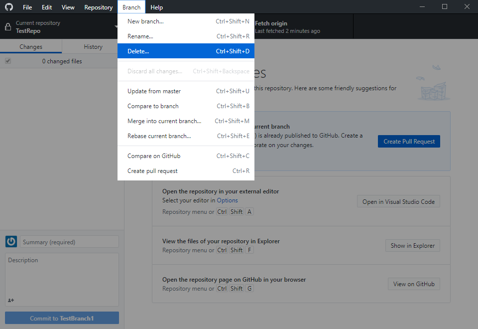
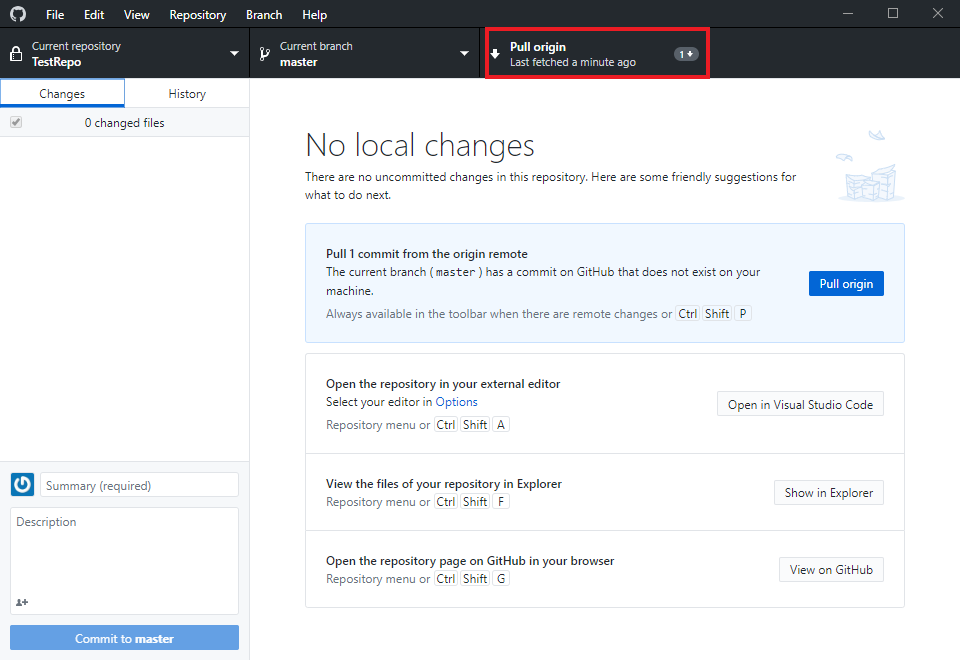

# GitHub 相关

## 入门手册

* 官方入门教程 <https://lab.github.com/>
* 部分操作演示 <https://dev.to/lydiahallie/cs-visualized-useful-git-commands-37p1>

## 代码库相关说明

0. 核心原则，**涉密不上网，上网不涉密**
1. 可以公开的学习资料，比如阅读笔记、操作记录、代码等：个人公开库或组内公开库
2. 正在准备的论文、代码：**务必**使用个人**私有库**或者组内**私有库**
3. 其他自己想储存的内容：自行判断私有与共有库利弊选择是否公开

## 常用命令及概念说明

### 1.  `git init`

#### 1.1 命令说明

`git init`用于在当前目录中创建一个新的本地仓库。

#### 1.2 使用说明
#### 1.2.1 GitHub Desktop
在GitHub Desktop中依次选择菜单`File\New repository`，也可以使用快捷键`Ctrl+N`。如下图：


点击`New repository`后，会弹出如下图所示的窗口。


1. 新创建的仓库的名称；
2. 对新创建仓库的简要描述。在 GitHub 网页上，该描述会显示在仓库名的下方；
3. 新建仓库在本地的储存位置。GitHub Desktop 会在该路径下创建与项目名同名的文件夹，并将仓库中的内容存放在创建的文件夹中；
4. 自动生成一个 README.md 文件并添加在仓库中。在自动创建的 README.md 中，标题是仓库名称，内容是`Description`栏中的描述；
5. 创建`.gitignore`文件，在之后的上传中，会按照`.gitignore`中的配置忽略相应的文件；
6. 选择一个`license`。关于如何选择合适的`license`，可以参照[这篇文章](https://blog.csdn.net/wadefelix/article/details/6384317)。

点击`Create repository`。如果看到了`Publish repository`按钮亮起，如下图所示，说明本地仓库创建成功。


#### 1.2.2 Git Bash

> 下面的`bash`代码中，`$`之后的是命令部分，`$`本身不是命令中的内容；没有特殊符号开头的行是上一条命令的执行结果；`#`开头的行是注释。下同。

在目录中执行`git init`命令，就可以在当前目录中创建一个 Git 仓库。比如在用户名为`YourName`的用户主文件夹下创建一个名为`TestRepo`的目录，需要执行如下命令：

```bash
# git init example
$ mkdir TestRepo
$ cd TestRepo
$ git init
Initialized empty Git repository in /home/YourName/TestRepo/.git/
```

现在使用`ls -a`命令查看当前文件夹，会发现生成了`.git`子目录，如下：

```bash
$ ls -a
. .. .git
```

说明本地 Git 仓库创建成功。

### 2.  `git clone`

#### 2.1 命令说明

`git clone`拷贝一个 Git 仓库到本地。拷贝后可以在本地查看或修改该项目。

#### 2.2 使用说明

#### 2.2.1 GitHub Desktop

在GitHub Desktop中依次选择菜单`File\Clone repository`，也可以使用快捷键`Ctrl+Shift+O`。如下图：


点击`Clone repository`后，会弹出如下图所示的窗口。


在`GitHub.com`一栏中，可以找到自己账户中的库并克隆到本地。如果是给定 url 的库，需要按上图所示，将仓库的 url 拷贝到文本框 1，在文本框 2 中选择仓库在本地的目录。完成后点击`Clone`按钮即可。

#### 2.2 Git Bash

执行命令

```bash
$ git clone [url]
```

其中 [url] 是你想要复制到本地的项目地址。例如用户名为`YourName`的用户名为`TestRepo`的仓库`https://github.com/YourName/TestRepo.git`。执行如下命令：

```bash
# git clone example
$ git clone https://github.com/YourName/TestRepo.git
Cloning into 'TestRepo'...
remote: Enumerating objects: 7, done.
remote: Counting objects: 100% (7/7), done.
remote: Compressing objects: 100% (5/5), done.
remote: Total 7 (delta 2), reused 5 (delta 0), pack-reused 0
Unpacking objects: 100% (7/7), done.
```

克隆完成后会在当前目录下生成一个`TestRepo`目录。`git clone`命令默认在当前目录下创建一个与项目同名的目录存放克隆的仓库文件，如果想指定创建的目录名，在`git clone`命令后面添加你想要的名称即可。例如：

```bash
$ git clone https://github.com/YourName/TestRepo.git TestRepoRename
```

上述命令将`TestRepo`仓库克隆到当前目录下名为`TestRepoRename`的目录中。

### 3. `git commit`

#### 3.1 命令说明

`git commit`命令将暂存区里的内容提交到本地仓库中。每次使用`git commit`命令时会生成一个唯一的`commit-id`，在任何时候可以通过这个 id 回退到对应 commit 之前的仓库内容。

#### 3.2 使用说明

#### 3.2.1 GitHub Desktop

在 Git 仓库中修改或添加文件后，左侧的 `Changes`一栏会显示对应的修改。例如在`TestRepo`仓库中添加文件`file1.txt`，添加后如下图所示：


在文本框 1 (Summary)中添加简要描述，在文本框 2 (Description)中添加详细描述。每次提交**必须**要有 Summary， Description 可写可不写。之后点击`Commit`按钮，完成提交。

#### 3.2.2 Git Bash

Git 会为每一次的提交记录用户名和邮箱地址。所以在第一次提交前需要配置用户名和账户地址。

```bash
$ git config --global user.name "YourName"
$ git config --global user.email your@email.com
```

在 Git Bash 中执行`git commit`前，需要先执行`git add`命令将修改的文件添加到暂存区。`git add`命令的使用方式如下：

```bash
$ git add filename1 filename2 ...
```

如果要添加所有改动的文件，可以使用`git add .`命令。

在执行完`git add`后，使用`git commit`指令提交对文件的所有改动。每次提交**必须**要有`-m`选项和提交注释（相当于 GitHub  Desktop 的 Summary 文本框）。例如在`TestRepo`仓库中添加文件`file2.txt`，执行如下命令：

```bash
# git commit example
$ git add .
$ git commit -m "Add a new file."
[master c5e1c51] Add a new file.
 1 file changed, 1 insertion(+)
 create mode 100644 file2.txt
```

可以使用`git commit -a`选项跳过`git add`这一步。对应上面的例子：

```bash
# git commit example without `git add .`
$ git commit -am "Add a new file."
[master 89c1b4b] Add a new file.
 1 file changed, 1 insertion(+)
```

### 4.  `git branch`

#### 4.1 命令说明

Git 的分支允许开发者从开发主线上分离，在不影响主线内容的同时继续进行代码管理。`git branch`命令用于列出分支、创建分支和删除分支。

#### 4.2 使用说明

#### 4.2.1 GitHub Desktop

在`Current branch`栏中点击`New branch`，输入新 branch 名称即可创建。如下图：




创建新分支后，在`Current branch`栏中可以看到新创建的分支。如果要删除当前分支，在最上方菜单栏中选择`Branch\Delete`，或使用快捷键`Ctrl+Shift+D`，如下图：



点击后会弹出确认框，点击确定后即可删除当前所在分支。

#### 4.2.2 Git Bash

`git branch`命令会列出在本地的分支。比如对`TestRepo`仓库，有：

```bash
# git branch example
$ git branch
  TestBranch1
* master
```

`*`号标记的表示当前所在的分支。

如果要创建一个新的分支，例如`TestBranch2`，在`git branch`命令后添加新分支名即可。例如：

```bash
# git branch example
$ git branch TestBranch2
$ git branch
  TestBranch1
  TestBranch2
* master
```

可以看到新分支已经创建。

如果要删除分支，使用`-d`命令。例如删除`TestBranch2`分支：

```bash
# git branch example
$ git branch -d TestBranch2
Deleted branch TestBranch2 (was 89c1b4b).
$ git branch
  TestBranch1
* master
```

可以看到刚刚创建的分支`TestBranch2`已被删除。

### 5. `git push`

#### 5.1 命令说明

之前的 4 个命令都是操作本地版本库。在本地版本库修改完成后，使用`git push`命令将本地分支推送到远程服务器上对应的分支。

#### 5.2 使用说明

#### 5.2.1 GitHub Desktop

执行`commit`命令提交后，点击`Push origin`即可，提交的内容会同步到`Current branch`中选择的分支里。


#### 5.2.2 Git Bash

`git push`命令的一般形式为`git push <远程主机名> <本地分支名>:<远程分支名>`，其中`<>`内的内容均可以省略：

1. 如果省略远程分支名，则表示将本地分支推送到远程存在追踪关系（通常是两者同名）的分支，如果该远程分支不存在，则会被新建。例如：`git push origin master`；
2. 如果省略本地分支名，则表示删除指定的远程分支（因为推送一个空的本地分支到远程分支），等同于`git push origin -delete BranchName`。例如：`git push origin :TestBranch1`；
3. 如果当前分支与远程分支存在追踪关系，则本地分支和远程分支都可以省略，将当前分支推送到`origin`主机对应的分支。例如：`git push origin`；
4. 如果当前分支只有一个远程分支，那主机名也可以省略，只需要`git push`即可。

例如，将修改后的`file1.txt`推送到`TestRepo`仓库的`TestBranch1`分支，需要执行的命令为：

```bash
# git push example
$ git add .
$ git commit -m "Add new line in file1.txt"
[master 239d838] Add new line in file1.txt
 1 file changed, 2 insertions(+), 1 deletion(-)
$ git push origin master:TestBranch1
Enumerating objects: 5, done.
Counting objects: 100% (5/5), done.
Delta compression using up to 6 threads
Compressing objects: 100% (2/2), done.
Writing objects: 100% (3/3), 322 bytes | 322.00 KiB/s, done.
Total 3 (delta 1), reused 0 (delta 0)
remote: Resolving deltas: 100% (1/1), completed with 1 local object.
To https://github.com/YourName/TestRepo.git
   89c1b4b..239d838  master -> TestBranch1
```

### 6. `git pull`

#### 6.1 命令说明

`git pull`命令用于将远程分支拉取到指定本地分支。

#### 6.2 使用说明

#### 6.2.1 GitHub Desktop

远程仓库修改后，红框对应的位置会出现`Pull origin`，点击该按钮即可将远程仓库的内容同步到`Current branch`中选择的分支里。



#### 6.2.2 Git Bash

`git pull`命令的一般形式为`git pull <远程主机名> <远程分支名>:<本地分支名>`，其中`<>`中的内容可以省略：

1. 如果远程分支是与当前分支合并，则本地分支名可以省略。例如：`git pull origin master`；
2. 如果当前分支与远程分支存在追踪关系，则远程分支名也可以省略。例如：`git pull origin`；
3. 如果当前分支只有一个追踪分支，则远程主机名都可以省略。例如：`git pull`

例如，我们在远程修改了`README.md`，现在想将该修改合并到本地库，需要执行的命令为：

```bash
# git pull example
$ git pull origin master:matser
From https://github.com/YourName/TestRepo
   89c1b4b..130c342  master     -> master
warning: fetch updated the current branch head.
fast-forwarding your working tree from
commit 89c1b4bc76530e11ba12205f208d38c204c1956f.
Already up to date.
```

> `git pull`命令会将远程获取的最新版本合并到本地仓库。如果不想自动合并，可以使用`git fetch`指令。


# TODO:

* [x] init
* [x] clone
* [x] commit
* [x] branch
* [x] push 
* [x] pull 
* [ ] checkout 
* [ ] merge
* [ ] 一份简单的 git 命令的 cheatsheet
